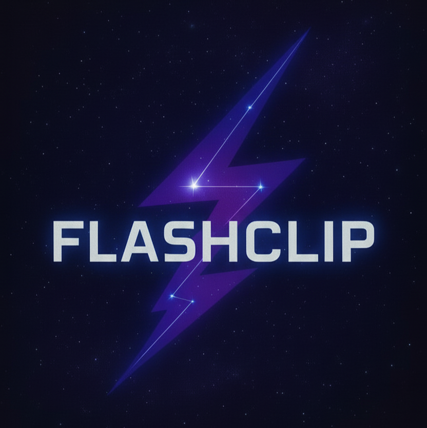

# FlashClip ⚡ - Evento Universitário de Programação



Site oficial do evento **FlashClip**, um evento universitário de programação com tema de constelações e tecnologia, realizado na **Ulbra Palmas, Tocantins**.

---

## 🌟 Sobre o Evento

**FlashClip** é um evento inovador que conecta estudantes ao futuro da programação através de cursos práticos de 3 horas, instrutores experientes e uma experiência imersiva com design futurista.

- 📅 **Data:** 28 de Novembro de 2025
- ⏰ **Horário:** 14:00 (UTC-3)
- 📍 **Local:** Ulbra Palmas, TO
- ⏱️ **Duração:** 3 horas por curso
- 🎓 **Certificado Digital** incluído

---

## 💻 Linguagens e Cursos Oferecidos

- **C++** - Programação de sistemas e alto desempenho
- **JavaScript** - Desenvolvimento web moderno e interativo
- **Elixir** - Programação funcional e sistemas escaláveis
- **PHP** - Desenvolvimento web dinâmico e backend
- **Prolog** - Programação lógica e inteligência artificial

---

## 🚀 Tecnologias Utilizadas

Este site foi desenvolvido com tecnologias modernas:

- ⚛️ **React 18** - Library JavaScript para interfaces
- ⚡ **Vite** - Build tool ultrarrápido
- 📘 **TypeScript** - JavaScript com tipagem estática
- 🎨 **Tailwind CSS** - Framework CSS utility-first
- 🧭 **React Router** - Navegação client-side
- 🎯 **Lucide React** - Ícones SVG modernos
- 🧩 **Shadcn UI** - Componentes acessíveis e customizáveis

---

## 🎨 Design System

### Paleta de Cores (Tema Constelação)

```css
/* Roxo LED (Primária) */
--primary: hsl(260, 85%, 65%)     /* #6D4AFF */

/* Ciano Neon (Secundária) */
--secondary: hsl(280, 70%, 60%)   /* ~#B366FF */

/* Background Escuro */
--background: hsl(230, 45%, 5%)   /* #070B1E */

/* Texto Branco */
--foreground: hsl(240, 20%, 95%)  /* #F2F2F7 */

/* Texto Secundário (Lavanda) */
--muted-foreground: hsl(240, 10%, 60%) /* #CFCFF5 */
```

### Tipografia

- **Fonte Principal:** `Inter` (sans-serif) - clara, moderna e legível
- **Fonte Monospace:** `JetBrains Mono` - para destaques técnicos

### Tema Visual: Constelações 🌌

- ✨ Background animado com estrelas e partículas
- 💜 Efeitos de brilho neon (glow) em roxo e ciano
- 🌐 Grade geométrica sutil inspirada em código
- 🎭 Animações suaves com suporte a `prefers-reduced-motion`
- 🌠 Halo de constelação ao redor da logo principal

---

## 📦 Instalação e Desenvolvimento

### Pré-requisitos

- Node.js 18+ (recomendado: versão LTS)
- npm, yarn ou pnpm

### Passos de Instalação

```bash
# 1. Clone o repositório
git clone <YOUR_GIT_URL>

# 2. Entre no diretório
cd flashclip

# 3. Instale as dependências
npm install

# 4. Inicie o servidor de desenvolvimento
npm run dev
```

O site estará disponível em: `http://localhost:5173`

### Build para Produção

```bash
# Gere a build otimizada
npm run build

# Preview da build de produção
npm run preview
```

---

## 📁 Estrutura do Projeto

```
flashclip/
├── public/
│   ├── favicon.png              # Favicon do site
│   ├── flashclip-logo.png       # Logo principal
│   └── robots.txt               # SEO
├── src/
│   ├── assets/
│   │   └── flashclip-logo.png   # Logo (importável)
│   ├── components/
│   │   ├── ui/                  # Componentes Shadcn UI
│   │   ├── Countdown.tsx        # Contador regressivo
│   │   ├── Footer.tsx           # Rodapé
│   │   ├── LogoFlashClip.tsx    # Logo reutilizável
│   │   ├── Navbar.tsx           # Navegação
│   │   └── StarryBackground.tsx # Background animado
│   ├── data/
│   │   └── instructors.json     # Dados dos 28 instrutores
│   ├── pages/
│   │   ├── Home.tsx             # Página inicial (hero + countdown)
│   │   ├── Cursos.tsx           # Lista de cursos
│   │   ├── Programacao.tsx      # Timeline do evento
│   │   ├── Instrutores.tsx      # Grid de instrutores
│   │   ├── Patrocinadores.tsx   # Parceiros e patrocinadores
│   │   ├── Contato.tsx          # Formulário de contato
│   │   ├── Inscricao.tsx        # Formulário de inscrição
│   │   ├── Sobre.tsx            # Sobre o FlashClip
│   │   └── FAQ.tsx              # Perguntas frequentes
│   ├── App.tsx                  # Rotas e layout principal
│   ├── index.css                # Design system (variáveis CSS)
│   └── main.tsx                 # Entry point
├── index.html                    # HTML base + meta tags
├── tailwind.config.ts            # Configuração Tailwind
├── tsconfig.json                 # TypeScript config
└── vite.config.ts                # Vite config
```

---

## 🧩 Componentes Reutilizáveis

### `<LogoFlashClip />`

Componente flexível da logo com múltiplas variantes:

```tsx
<LogoFlashClip 
  variant="full"  // "full" (logo + texto) | "icon" (só logo)
  size="md"       // "sm" | "md" | "lg" | "xl"
  rounded={true}  // aplica border-radius circular
  className=""    // classes adicionais
/>
```

### `<Countdown />`

Contador regressivo sincronizado para `2025-11-28T14:00:00-03:00`:

```tsx
<Countdown />
```

Exibe: **Dias | Horas | Minutos | Segundos**

### `<StarryBackground />`

Background com partículas animadas de estrelas:

```tsx
<StarryBackground />
```

- 150 estrelas com tamanhos variados
- Efeito twinkle (piscante)
- Respeita `prefers-reduced-motion`

---

## ✨ Features Implementadas

- ✅ Design 100% responsivo (mobile-first)
- ✅ Tema dark com paleta roxo neon + ciano
- ✅ Background animado com estrelas e parallax
- ✅ Contador regressivo sincronizado por timezone
- ✅ Navegação multi-página com React Router
- ✅ Cards uniformes e consistentes (altura igual)
- ✅ Efeitos hover com scale e glow
- ✅ SEO otimizado (title, description, Open Graph, Twitter Cards)
- ✅ Acessibilidade (contraste WCAG, semântica HTML5)
- ✅ Performance (lazy loading, build otimizado)
- ✅ Suporte a `prefers-reduced-motion`
- ✅ 28 instrutores com dados estruturados em JSON

---

## 🌐 SEO e Meta Tags

O site inclui meta tags completas para:

- 🔍 **Google Search** (title, description, keywords)
- 📘 **Facebook** (Open Graph protocol)
- 🐦 **Twitter** (Twitter Cards)
- 🔗 **Compartilhamento social** otimizado

### Exemplo de Meta Tags

```html
<title>FlashClip | Evento Universitário de Programação - 28/11/2025</title>
<meta name="description" content="FlashClip é um evento universitário de programação na Ulbra Palmas, TO. Cursos de C++, JavaScript, Elixir, PHP e Prolog. Inscreva-se agora!" />
<meta property="og:image" content="/flashclip-logo.png" />
```

---

## 🎯 Variáveis de Ambiente (Opcional)

Para funcionalidades avançadas, crie um arquivo `.env`:

```env
# Google Maps API (para exibir mapa na página de Contato)
VITE_GOOGLE_MAPS_API_KEY=sua_chave_aqui

# Email de backend (se integrar formulário)
VITE_CONTACT_EMAIL=contato.flashclip@gmail.com
```

---

## 🧪 Testes e Validação

### Lighthouse Score

Execute o Lighthouse para validar:
- Performance
- Acessibilidade
- SEO
- Best Practices

```bash
npm run build
npm run preview
# Abra o Chrome DevTools > Lighthouse
```

### Teste de Responsividade

Teste em múltiplos dispositivos:
- 📱 Mobile (375px)
- 📱 Tablet (768px)
- 💻 Desktop (1024px+)

---

## 🤝 Como Contribuir

Contribuições são bem-vindas! Siga o fluxo:

1. **Fork** o repositório
2. Crie uma **branch** para sua feature
   ```bash
   git checkout -b feature/MinhaNovaFeature
   ```
3. **Commit** suas mudanças
   ```bash
   git commit -m "Add: Nova feature incrível"
   ```
4. **Push** para sua branch
   ```bash
   git push origin feature/MinhaNovaFeature
   ```
5. Abra um **Pull Request**

---

## 📞 Contato

Entre em contato com a equipe FlashClip:

- 📧 **Email:** contato.flashclip@gmail.com
- 📱 **WhatsApp:** +55 (63) 98421-0122
- 📷 **Instagram:** [@flashclip](https://instagram.com/flashclip)
- 🏢 **Local:** Ulbra Palmas, Tocantins

---

## 📄 Licença

Este projeto é de propriedade da **Ulbra Palmas** e do evento **FlashClip** (2025).

Todos os direitos reservados.

---

## 🚀 Deploy

### Lovable (Recomendado)

Simplesmente abra o projeto no [Lovable](https://lovable.dev/projects/53fd63de-2a27-42ef-bf46-826490e0fa4d) e clique em **Share → Publish**.

### Outras Plataformas

- **Vercel:** `vercel --prod`
- **Netlify:** `netlify deploy --prod`
- **GitHub Pages:** Configure com `gh-pages`

---

<div align="center">

**Conecte-se ao futuro da programação** 🚀✨

Desenvolvido com 💜 pela equipe FlashClip

[🌐 Site Oficial](https://flashclip.lovable.app) • [📷 Instagram](https://instagram.com/flashclip) • [📧 Contato](mailto:contato.flashclip@gmail.com)

</div>
